# Otteri-synth

<p align="center">
    
    <br/>
    Cause otters like to play!
</p>

## Table of Contents

- [Otteri-synth](#otteri-synth)
  - [Table of Contents](#table-of-contents)
- [Introduction](#introduction)
- [Design](#design)
- [Hardware](#hardware)
  - [Parts List](#parts-list)
  - [Case](#case)
  - [Microcontroller](#microcontroller)
  - [Amplifier \& speakers](#amplifier--speakers)
  - [Power management](#power-management)
  - [Wiring diagram](#wiring-diagram)
  - [Final print config](#final-print-config)
  - [Putting it all together](#putting-it-all-together)
    - [KiCad](#kicad)
  - [Importing Teensy into KiCad](#importing-teensy-into-kicad)
  - [Schematics and PCB design](#schematics-and-pcb-design)
  - [Implementation using Perf Board](#implementation-using-perf-board)
- [Software](#software)
- [Demo](#demo)


# Introduction
For fun I wanted to create a synthesizer that looks like an otter. It should be my daughters firsth synth :)

In these modern times I wanted to leverage what new tools have been available to design this project. In my mind I had a clear vision how the synth should look and play. I never did such a project before, so it was also a learning experience for me.

# Design
As the base I generated an image using [DALL-E](https://openai.com/index/dall-e-2/) and fed it into [TRELLIS](https://huggingface.co/JeffreyXiang/TRELLIS-image-large).

The prompt was:
```bash
Create a prototype of a synthesizer case.
White background, it is important that there is no background at all in the image. Should be childrens style, cool design and possible to 3d print on a 3d printer. I want to actually implement the case and use it for a synth project.
The synth should somewhat look like an otter.

# after some back and forth with some prototypes that had too many hands :P
There are too many hands, start over with an otter design, surprise me with a new and cool idea
```

In the end I was able to create an image in DALL-E that exactly matched what I had in mind.

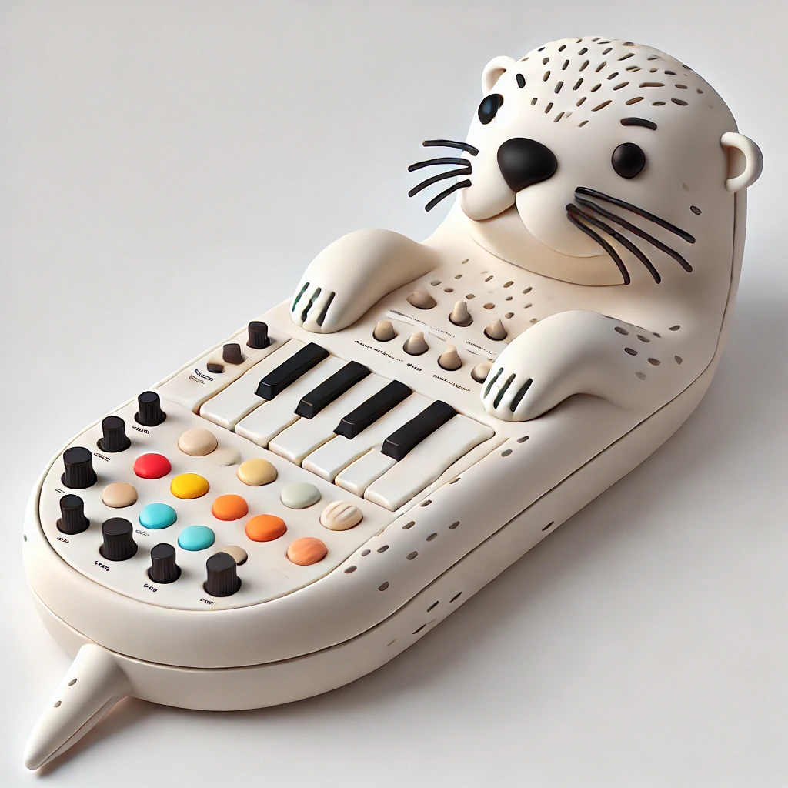


TRELLIS created an amazing mesh out of it that I could directly use as a starting point in [Blender](https://www.blender.org/).
You can find and download the mesh [here](.attachements/otteri-synth-generated.glb).

I then adapted the generated mesh to my liking and needs.

# Hardware

Because I have a 3d printer, the case and inner works was specially made for this synth.

## Parts List

Here is a quick overview of the used parts. A detailed description can be found below.

| Part                     | Amount | Description                                      |
| ------------------------ | ------ | ------------------------------------------------ |
| 3D Printed Case          | 1      | Custom case to house all components              |
| Teensy 3.2               | 1      | Microcontroller for handling audio processing    |
| Teensy Audio Shield      | 1      | Audio processing shield for Teensy               |
| Adafruit MAX7944         | 1      | Amplifier for driving the speakers               |
| 4Ohm 3W 40mm Speakers    | 2      | Small speakers for audio output                  |
| Arcade Buttons           | 10     | Durable buttons for user interaction             |
| Various Wires            | -      | Wiring for connecting all components             |

## Case

The initial prototype was small, but after confirming its success, I scaled up the design to accommodate robust electronics suitable for a child's enthusiastic use. 

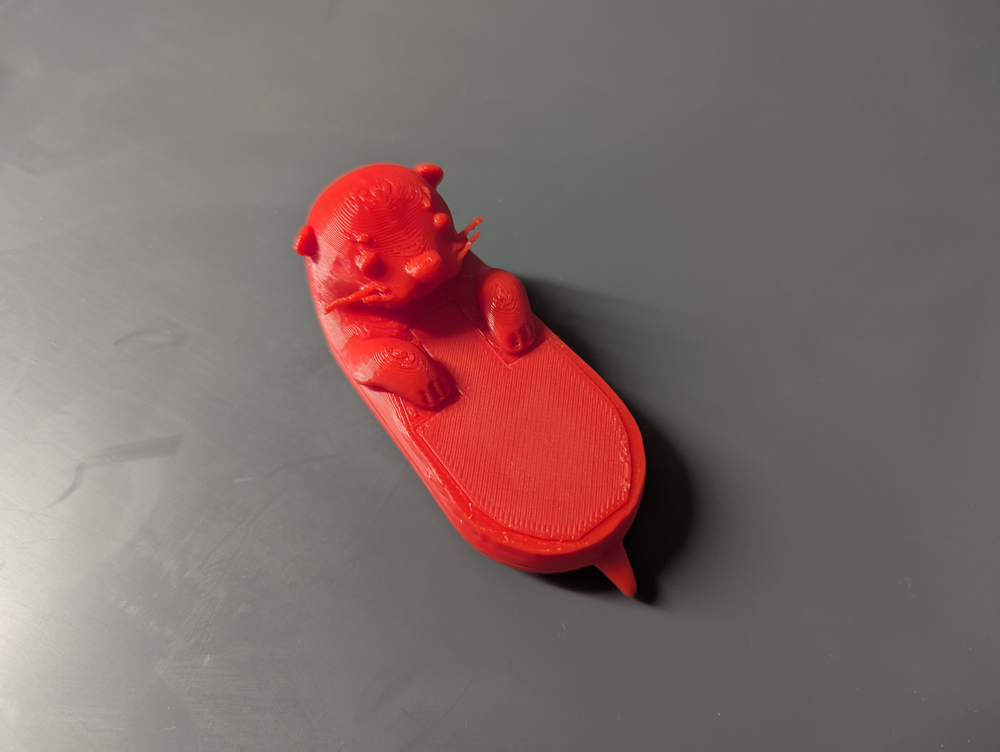
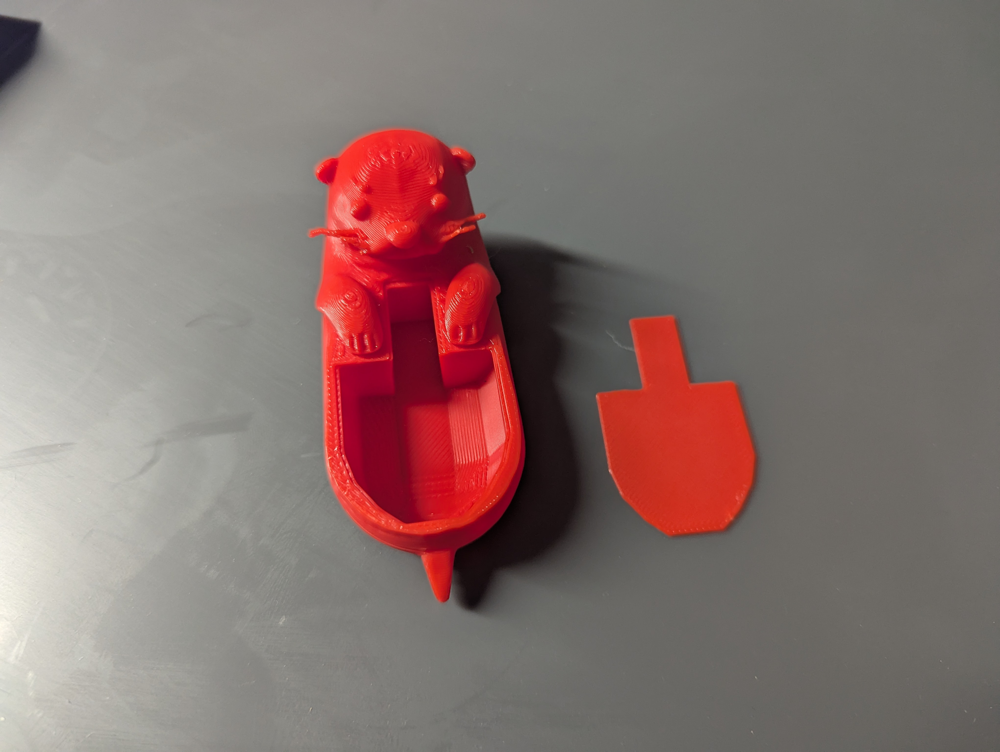

I opted for durable arcade buttons to withstand frequent interaction.

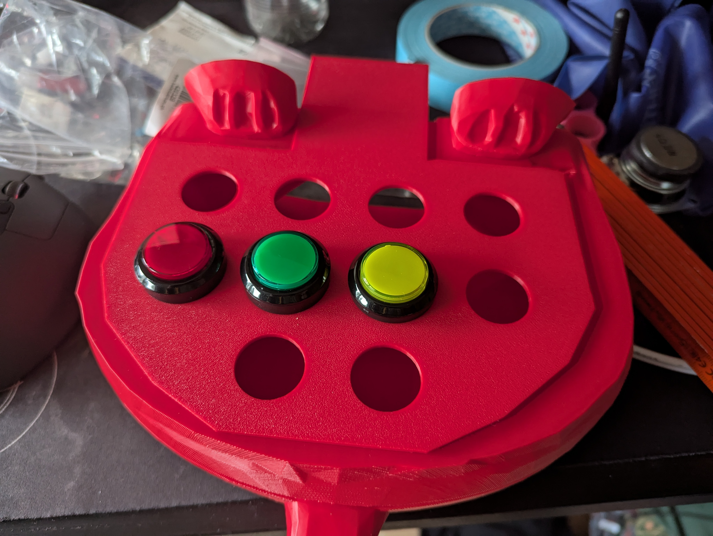

## Microcontroller

The core of the Otteri-synth is powered by a [Teensy 3.2](https://www.pjrc.com/store/teensy32.html) with the [Teensy Audio Shield](https://www.pjrc.com/store/teensy3_audio.html) as I still had them laying around at home.

The Teensy is excellent for synthesizer projects due to its high-performance ARM Cortex-M4 processor and real-time audio processing capabilities,

I'm a big fan of the teensy boards!

## Amplifier & speakers

Another component I still had laying around at home was an [Adafruit MAX7944](https://www.adafruit.com/product/1752) amplifier. For the speakers size, this will be more then enough.

As speakers I'm using 2 4Ohm 3W 40mm. They might be a little small, but should do the job.

## Power management

Teensy supports 5V power input, the amplifier needs 12V. In order to now have 2 inputs for power, I'm using a [Buck Converter - U125 - ME3116AM6G Step-Down Voltage Converter Unit, 5V, 1A](https://www.distrelec.ch/en/me3116am6g-step-down-voltage-converter-unit-5v-1a-m5stack-u125/p/30230761) to have the 12V shared input stepped down to 5V for the teensy:

```

          +---------------+
          |  12V Supply   |
          +---------------+
                |   |
                |   | 
         +------+   +------+  
         |                 |
  [Buck Converter]         |  
         |                 |
      5V Output        12V Output
         |                 |
   +-----+----+      +-----+-----+
   |  Teensy  |      | Amplifier |
   |   3.2    |      | (MAX9744) |
   +----------+      +-----------+
         |                 |
         +-- Common Ground --------+
```

## Wiring diagram

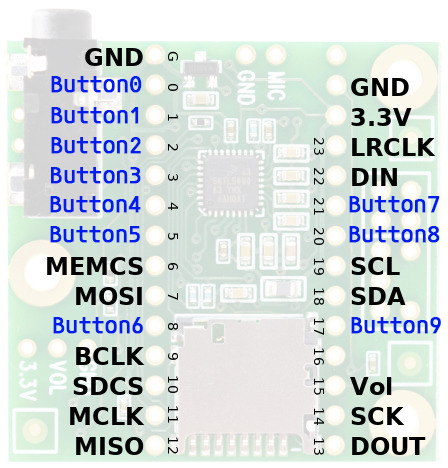

| Button   | Pin | Description                             |
| -------- | --- | --------------------------------------- |
| Button 0 | 0   | Play note C                             |
| Button 1 | 1   | Play note D                             |
| Button 2 | 2   | Play note E                             |
| Button 3 | 3   | Play note F                             |
| Button 4 | 4   | Play note G                             |
| Button 5 | 5   | Play note A                             |
| Button 6 | 8   | Play note B                             |
| Button 7 | 21  | Play note C                             |
| Button 8 | 20  | Change preset (instrument) + volume     |
| Button 9 | 17  | Change octave + volume                  |

*Additional note:* I added the functionality to change the volume by holding down Button 8 and Button 9 simultaneously and then changing the volume down or up with Button 0 and Button 1.

## Final print config

The first half I printed had way too small dowels. So they ended up breaking when being inserted into the body. 

So in try 2, I cut the Otter in Bambu Studio, using hexagons dowels with length 2cm and 1.5cm diameter as connectors. Initially I had a small gap between the two pieces. So I manually reduced the length of the dowels and re-printed just these.

**TODO: Add 3mf file of project...**

## Putting it all together

A first circuit prototype was made with a breadboard and some initial buttons I had still at home. The order for the remaining buttons was on it's way.

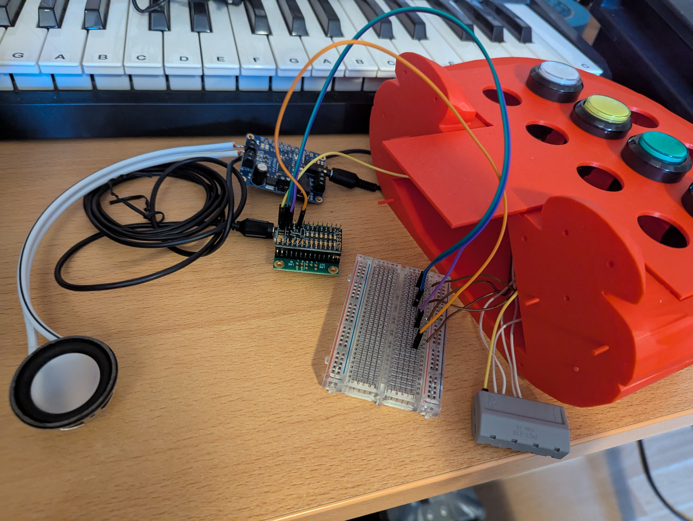

To fix the plate with the buttons to the body of the synth, I got melt threads in M3 size, like these:
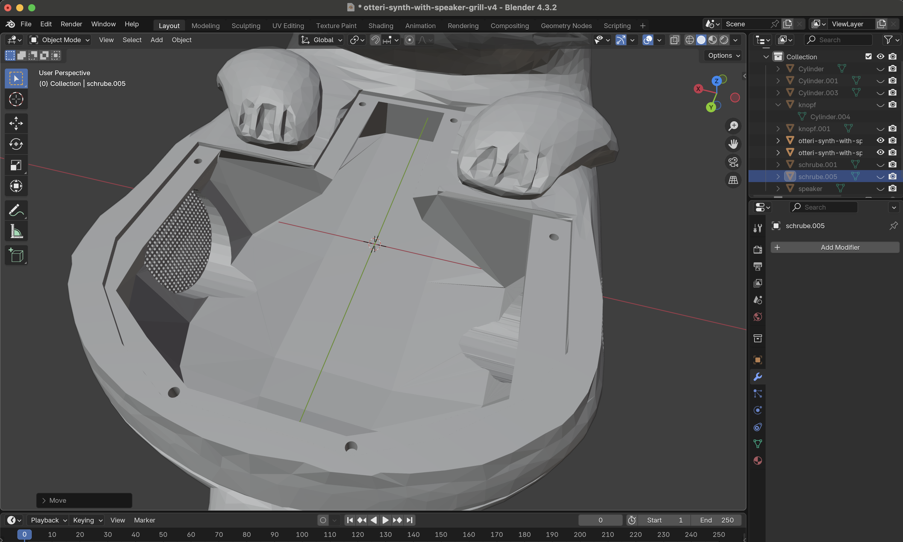


In Blender I prepared the matching 4mm holes to fix the threads in.
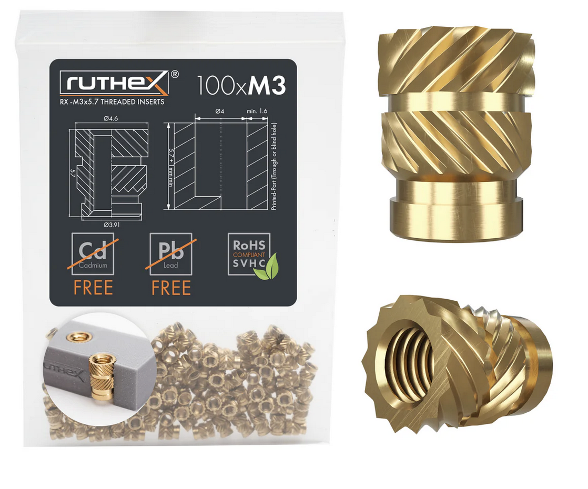

The first full print was a success (even if the filament ran out and I had to switch to a different color to finish the print). I was able to verify my design and continue with the final hardware steps.

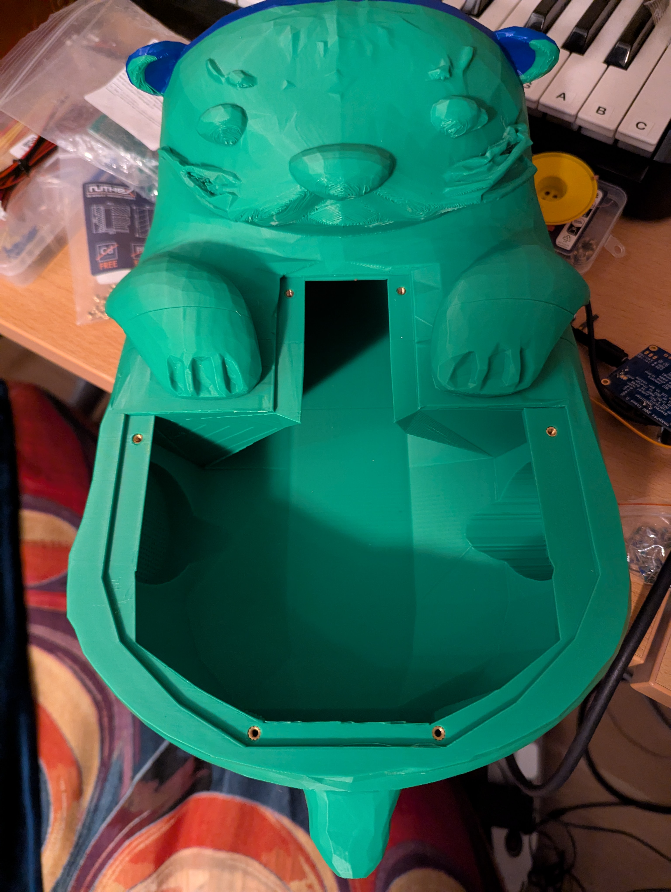


### KiCad

Initially I had the idea to create and print a custom PDB for this project.
But after designing it and realizing the simplicity, I went with a prefboard setup.

Nevertheless, I went through the steps of creating the project and gerber files for the synth in Kicad as a learning excercise.
I started with importing the footpint into KiCad, arranging the schematics and drawing the PCB.

## Importing Teensy into KiCad
Download Teensy files from:
* [Teensy Library](https://github.com/XenGi/teensy_library)
* [Teensy.Pretty](https://github.com/XenGi/teensy.pretty)

And add them following these steps:

1. Open the Footprint Editor: From the main window in KiCad, navigate to Tools > Footprint Editor.
2. Manage Footprint Libraries (Symbol in the opened window):
    1. Within the Footprint Editor, go to Preferences > Manage Footprint Libraries....
    You’ll see two tabs: "Global Libraries" (libraries available to all projects) and "Project Specific Libraries" (libraries only available to the current project).
    2. To add a new library, click the “+” button under the appropriate tab.
    Point the file browser to the directory containing your .kicad_mod files. Select this directory as your library directory and provide a nickname for easy reference.
    3. Confirm your addition by clicking "OK".

Step 2: Manage Symbol Libraries

1. Access the Library Management:
    In the Symbol Editor, go to Preferences > Manage Symbol Libraries....
    This opens the Symbol Libraries Manager where you can add, remove, or modify symbol libraries.

1. Add a New Library:
    1. Click on the "Project Specific Libraries" tab to add the library only to your current project, or choose the "Global Libraries" tab to add the library to all KiCad projects on your system.
    1. Click the ‘+’ button at the bottom of the window to add a new library entry.

1. Specify Library Details:
    1. Nickname: Enter a nickname for the library. This nickname will be used to reference the library within KiCad.
    1. Library Path: Click on the folder icon next to the ‘Library Path’ field to browse to the location where you extracted your .lib file. Select the .lib file.
    1. Plugin Type: Ensure the plugin type is set to ‘Legacy’ for .lib files.
    The .dcm file, if located in the same directory, will automatically be linked for documentation purposes, so there's no need to do anything extra for it.

1. Confirm and Close:
    1. After entering all details, click “OK” to add the library.
    1. Close the Library Manager by clicking "OK" again.

## Schematics and PCB design

The schematics is created according the planned out pin setup above.

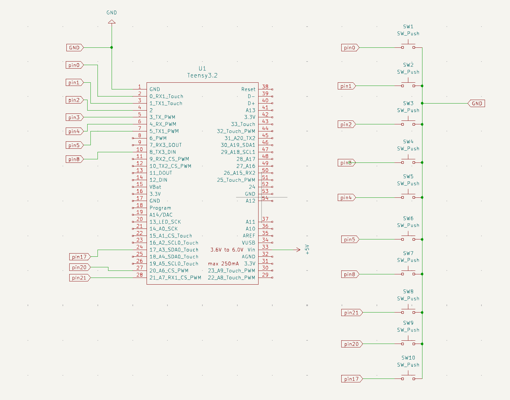

Out of the schematics, I was able to create an initial, simple PCB design.

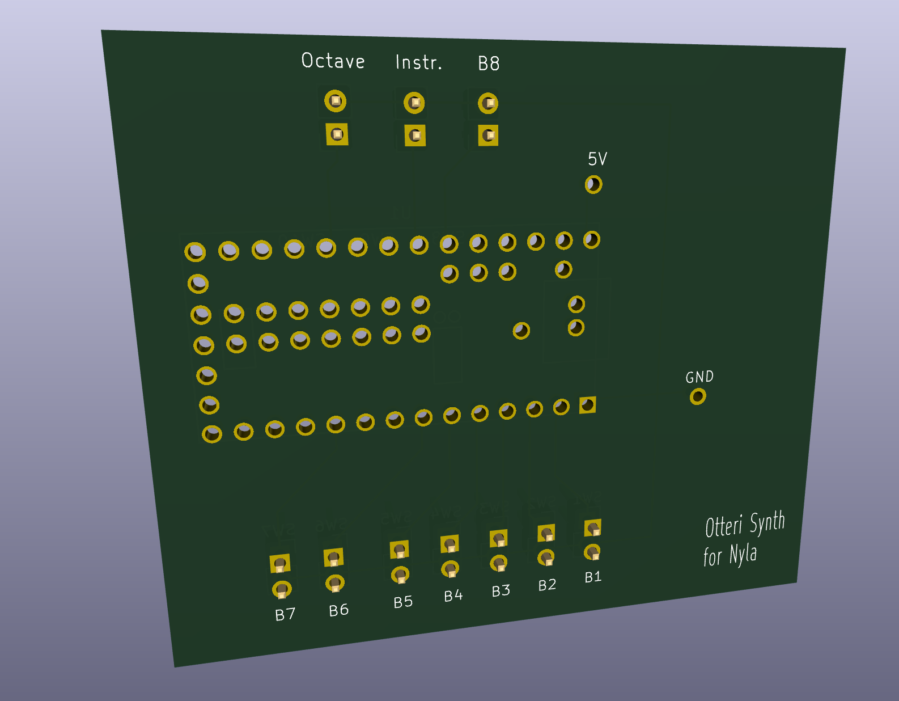
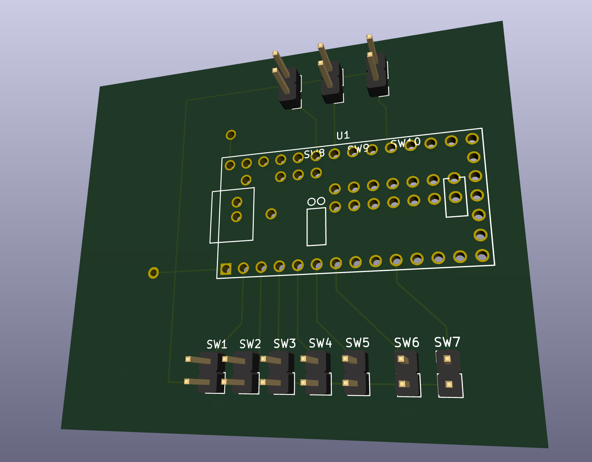

The files can be downloaded here:
* [Schematics](.attachements/otteri-synth.kicad_sch)
* [PCB Design](.attachements/otteri-synth.kicad_pcb)

## Implementation using Perf Board

Because the board was so simple, I ended up using a perf board and did the manual path setup using solder. 

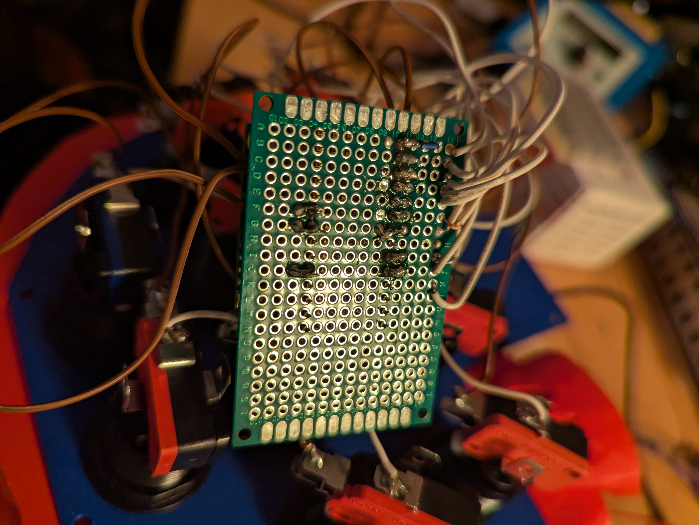

It does not look very nice, but works well and is sturdy.

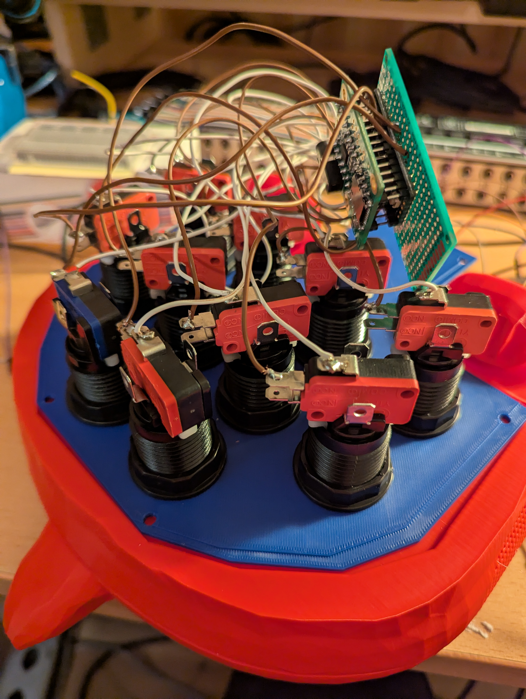


# Software

The project began with basic sketches in the Arduino IDE, but as the software evolved, I transitioned to [PlatformIO](https://platformio.org/) for enhanced code management and scalability.

The complete codebase is available in the `otteri-synth-code` directory.

I wanted to have multiple voices, in order to be able to not only play 1 key at a time. This was done by mutiplying the whole virtual audio setup 3 times and defining a common output to i2s.

I'm making heavy use of the [Teensy Audio Library](https://www.pjrc.com/teensy/td_libs_Audio.html) library.

# Demo

A demo of the sounds it makes before it got assambled: [Pre-assembly demo video](.attachements/first-demo.mov).
