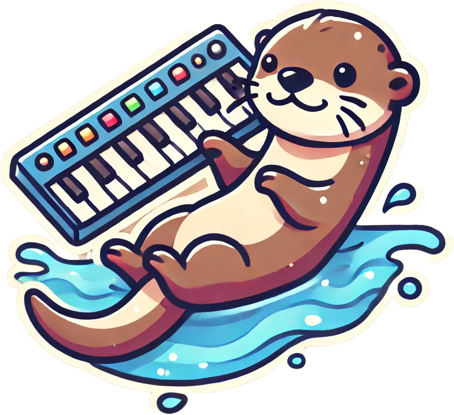

# Otteri-synth

    
     
    Cause otters like to play!

# Introduction
For fun I wanted to create a synthesizer that looks like an otter. It should be my daughters firsth synth :)

# Design
As the base I generated an image using DALL-E and fed it into [TRELLIS](https://huggingface.co/JeffreyXiang/TRELLIS-image-large).
I was able to create an image in DALL-E that exactly matched what I had in mind.

TRELLIS created an amazing mesh out of it that I could directly use as a starting point in [Blender](https://www.blender.org/).
You can find and download the mesh [here](.attachements/otteri-synth-generated.glb).

I then adapted the generated mesh to my liking and needs.

# Hardware

Because I have a 3d printer, the case and inner works was specially made for this synth.

## Parts List

Here is a quick overview of the used parts. A detailed description can be found below.

| Part                     | Amount | Description                                      |
| ------------------------ | ------ | ------------------------------------------------ |
| 3D Printed Case          | 1      | Custom case to house all components              |
| Teensy 3.2               | 1      | Microcontroller for handling audio processing    |
| Teensy Audio Shield      | 1      | Audio processing shield for Teensy               |
| Adafruit MAX7944         | 1      | Amplifier for driving the speakers               |
| 4Ohm 3W 40mm Speakers    | 2      | Small speakers for audio output                  |
| Arcade Buttons           | 10     | Durable buttons for user interaction             |
| Various Wires            | -      | Wiring for connecting all components             |

## Case

The initial prototype was small, but after confirming its success, I scaled up the design to accommodate robust electronics suitable for a child's enthusiastic use. 

I opted for durable arcade buttons to withstand frequent interaction.

## Microcontroller

The core of the Otteri-synth is powered by a [Teensy 3.2](https://www.pjrc.com/store/teensy32.html) with the [Teensy Audio Shield](https://www.pjrc.com/store/teensy3_audio.html) as I still had them laying around at home.

The Teensy is excellent for synthesizer projects due to its high-performance ARM Cortex-M4 processor and real-time audio processing capabilities,

I'm a big fan of the teensy boards!

## Amplifier & speakers

Another component I still had laying around at home was an [Adafruit MAX7944](https://www.adafruit.com/product/1752) amplifier. For the speakers size, this will be more then enough.

As speakers I'm using 2 4Ohm 3W 40mm. They might be a little small, but should do the job.

## Wiring diagram

| Button   | Pin | Description                    |
| -------- | --- | ------------------------------ |
| Button 0 | 0   | Play note C                    |
| Button 1 | 1   | Play note D                    |
| Button 2 | 2   | Play note E                    |
| Button 3 | 3   | Play note F                    |
| Button 4 | 4   | Play note G                    |
| Button 5 | 5   | Play note A                    |
| Button 6 | 8   | Play note B                    |
| Button 7 | 21  | Play note C (octave higher)    |
| Button 8 | 20  | Change preset (instrument)     |
| Button 9 | 17  | Change octave (& maybe volume) |

*Coming soon...*

## Putting it all together

# Software

The project began with basic sketches in the Arduino IDE, but as the software evolved, I transitioned to [PlatformIO](https://platformio.org/) for enhanced code management and scalability.

The complete codebase is available in the `otteri-synth-code` directory.

# Demo

*Coming soon...*